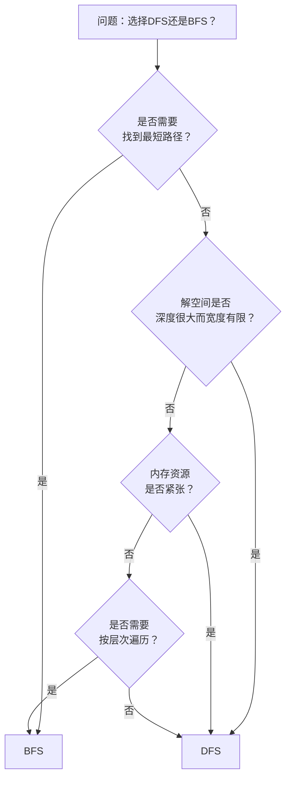

###Depth_First_search & Breadth_First_search

​	深度优先搜索（DFS）和广度优先搜索（BFS）是图论中两种最基础且至关重要的遍历算法。

| 评估维度             | 深度优先搜索 (DFS)                                           | 广度优先搜索 (BFS)                                           |
| -------------------- | ------------------------------------------------------------ | ------------------------------------------------------------ |
| **🧠 理论基础**       | **原理**：从起点开始，沿着一条路径尽可能深地探索，直到末端再回溯，尝试其他分支。**核心思想**是“一路到底，逐步退回”。**复杂度**：时间 O(\|V\|+ \|E\|)，空间 O(\|V\|)（递归深度或栈大小）。 | **原理**：从起点开始，先访问所有直接相邻的节点，然后再访问这些相邻节点的邻居，以此类推，**逐层扩散**。**核心思想**是“全面扩散、逐层递进”。**复杂度**：时间 O(\|V\|+ \|E\|)，空间 O(\|V\|)（队列大小，常存储整层节点）。 |
| **⚙️ 实现能力**       | **数据结构**：通常使用**栈**（递归调用栈或显式栈）。**关键点**：递归实现简洁，但需注意栈溢出风险；迭代实现需手动管理栈和访问顺序。 | **数据结构**：必须使用**队列**。**关键点**：实现相对直观，循环中出队一个节点，并将其所有未访问的邻居入队。 |
| **💡 应用与解决问题** | **适用场景**：路径存在性检查、拓扑排序、连通分量计数、回溯问题（如八皇后、迷宫所有路径）。**选择逻辑**：当问题需要**优先深入探索**或考察**完整路径**时。 | **适用场景**：**无权图的最短路径**问题、层序遍历、状态空间搜索（如求最少步骤）。**选择逻辑**：当问题需要**按层探索**或所求答案与**起点深度直接相关**时。 |
| **📊 算法优劣衡量**   | **优点**：内存消耗通常较低（尤其对于长路径）。对于深度较大的解可能更快。**缺点**：**不保证找到最短路径**，可能陷入深度无限的分支。 | **优点**：**能有效找到最短路径**（在无权图中），搜索过程相对完备。**缺点**：空间开销大，尤其在广度大的图中。 |

**快速选择指南**




###Prim & Kruskal Algorithm

📊 **核心特性对比**

| 特性             | Prim算法                                                     | Kruskal算法                                                  |
| ---------------- | ------------------------------------------------------------ | ------------------------------------------------------------ |
| **核心思想**     | **以顶点为核心**的贪心算法。从单个顶点开始，逐步扩展子树，每次添加连接子树与外部顶点的最小权边。 | **以边为核心**的贪心算法。对所有边按权重排序，从小到大依次选择，若边不构成环则加入生成树。 |
| **算法过程特点** | 算法执行过程中，始终维护一棵连通的树。                       | 算法执行过程中，是由多棵子树构成的森林，最后才连接成一棵树。 |
| **时间复杂度**   | 使用邻接矩阵为 **O(V²)**；使用邻接表+优先队列可达 **O(E log V)**。 | 主要开销在于边的排序，时间复杂度为 **O(E log E)**，也可记为O(E log V)。 |
| **空间复杂度**   | 主要为存储图结构，邻接矩阵为O(V²)，邻接表为O(V+E)。          | 主要为存储所有边O(E)，以及并查集开销O(V)。                   |
| **适用场景**     | 适合**稠密图**（边数E接近顶点数V的平方），因为其效率更依赖于顶点数。 | 适合**稀疏图**（边数E远小于V²），其效率更依赖于边数。        |

🧠 **算法原理步骤描述**

**Prim算法**:Prim算法像一个谨慎的画家，从画布上的一点开始，每次都用最短的笔触连接到新的点，最终让所有点都以最经济的方式连成一片。

```c
#define V 100 // 图中顶点数
#define INF 0x3f3f3f3f // 用一个大数表示无穷大

int graph[V][V]; // 邻接矩阵存储图

void primMST() {
    int parent[V];   // 用于记录最小生成树的父节点结构
    int key[V];      // 用于记录顶点到当前MST的最小边权值
    int inMST[V];    // 标记顶点是否已加入MST

    // 1. 初始化：将所有顶点的key值设为无穷大，且未加入MST
    for (int i = 0; i < V; i++) {
        key[i] = INF;
        inMST[i] = 0;
    }

    // 2. 选择起始顶点（例如0号顶点）
    key[0] = 0;
    parent[0] = -1; // 起始顶点没有父节点

    // 3. 循环V-1次，每次加入一个顶点
    for (int count = 0; count < V - 1; count++) {
        // a. 寻找未加入MST的顶点中key值最小的顶点u
        int min = INF, u;
        for (int v = 0; v < V; v++) {
            if (!inMST[v] && key[v] < min) {
                min = key[v];
                u = v;
            }
        }

        // b. 将顶点u标记为已加入MST
        inMST[u] = 1;

        // c. 更新与u相邻的所有未加入MST顶点的key值
        for (int v = 0; v < V; v++) {
            if (graph[u][v] && !inMST[v] && graph[u][v] < key[v]) {
                parent[v] = u;
                key[v] = graph[u][v];
            }
        }
    }
    // 此时，parent数组就描述了最小生成树的结构
}
```

**Kruskal算法**:Kruskal算法则像一个高效的整理员，先把所有的绳子（边）从短到长排好序，然后依次拿起最短的绳子连接尚未连通的区域，并确保不会打成死结（环）。

```c
#include <stdio.h>
#include <stdlib.h>

#define E 1000 // 图中边数
#define V 100  // 图中顶点数

struct Edge {
    int src, dest, weight;
};

struct Edge edges[E]; // 存储所有边的数组
int parent[V];        // 并查集结构，用于判断连通性

// 并查集：查找元素i的根节点（带路径压缩）
int find(int i) {
    if (parent[i] != i) {
        parent[i] = find(parent[i]); // 路径压缩
    }
    return parent[i];
}

// 并查集：合并两个集合
void unionSets(int x, int y) {
    int rootX = find(x);
    int rootY = find(y);
    parent[rootX] = rootY;
}

// 比较函数，用于qsort对边按权重排序
int compare(const void* a, const void* b) {
    struct Edge* edge1 = (struct Edge*)a;
    struct Edge* edge2 = (struct Edge*)b;
    return edge1->weight > edge2->weight;
}

void kruskalMST() {
    struct Edge result[V]; // 存储最小生成树的结果
    int e = 0; // 用于结果数组的索引
    int i = 0; // 用于遍历排序后的边数组

    // 1. 初始化并查集，每个顶点自成一个集合
    for (int v = 0; v < V; v++) {
        parent[v] = v;
    }

    // 2. 将所有边按权重升序排序
    qsort(edges, E, sizeof(edges[0]), compare);

    // 3. 遍历排序后的边，直到生成树中有V-1条边
    while (e < V - 1 && i < E) {
        struct Edge next_edge = edges[i++];

        // 4. 检查加入这条边是否会形成环
        int x = find(next_edge.src);
        int y = find(next_edge.dest);

        if (x != y) {
            // 若不形成环，则加入生成树，并合并集合
            result[e++] = next_edge;
            unionSets(x, y);
        }
    }
    // 此时，result数组就包含了最小生成树的所有边
}
```

💡 **算法选择与实际问题考量**

1. **图的结构**：面对稠密图（边数远大于顶点数），**Prim算法（尤其是邻接矩阵实现）通常更高效**。对于稀疏图，**Kruskal算法更具优势**。
2. **实现复杂度**：Kruskal算法需要实现并查集和排序，概念清晰。Prim算法的优先队列版本稍复杂，但邻接矩阵版本非常简单直观。
3. **特殊需求**：如果图是动态的（边会动态增加），Kruskal算法更容易适应，因为可以增量式地处理新边。而Prim算法则需要重新计算。

⚠️ **注意事项与常见错误**

- **Prim算法**：关键在正确维护每个顶点到当前生成树的**最小距离**（`key`数组），并确保每次更新新加入顶点的邻居时，**只更新那些尚未在生成树中的顶点**。
- **Kruskal算法**：核心在于**高效判断环的存在**，并查集是实现这一点的最佳选择。务必注意在合并集合时进行正确的**路径压缩或按秩合并**，以保证效率。


### Prim vs Dijkstra

​	Prim算法和Dijkstra算法确实很容易让人混淆，它们都是图论中非常重要的贪心算法，并且代码结构看起来很相似。不过，它们要解决的根本问题是不同的。

| 特性             | Prim算法                                                     | Dijkstra算法                                                 |
| ---------------- | ------------------------------------------------------------ | ------------------------------------------------------------ |
| **算法目标**     | 构建**最小生成树**，保证所有顶点以最小总权值和连通。         | 寻找**单源最短路径**，保证从一点到其他所有点的路径权值和最小。 |
| **问题场景**     | “如何用最低的总成本连接所有点？”（如：为整个小区铺设光纤网络，使总线路长度最短） | “从A点到其他所有点的最短路径分别是什么？”（如：地图导航，寻找从当前位置到各个目的地的最短行车路线） |
| **适用图类型**   | 通常用于**无向图**。                                         | 主要用于**有向图**，也可用于无向图（但不能有负权边）。       |
| **核心数据结构** | 使用优先队列（最小堆）或数组，维护每个顶点到**当前生成树**的最小权值。 | 使用优先队列（最小堆）或数组，维护每个顶点到**源点**的当前最短距离。 |
| **关键操作区别** | **更新**：`dist[v] = min(dist[v], weight(u, v))`。只考虑当前边的权值。 | **松弛**：`dist[v] = min(dist[v], dist[u] + weight(u, v))`。考虑从源点经过u到v的累积路径权值。 |
| **最终结果**     | 所有`dist`值之和是生成树的总权值。                           | 每个`dist`值是从源点到该顶点的最短路径长度。                 |

🔍 **深入理解关键区别**

​	这个“更新”和“松弛”操作的区别，是理解两者不同的关键。我们来看一个具体的例子。

​	假设有顶点A、B、C，边权为 A-B=2, B-C=2, A-C=3。源点是A。

- **Prim算法**的目标是连通所有顶点。它会先连接A-B（权2），然后对于C，它看到B-C的权（2）小于A-C的权（3），所以会选择连接B-C。总权值和是2+2=4。它不关心A到C的直达距离，只关心用最小的成本把C纳入当前的连通分量。
- **Dijkstra算法**的目标是求A到其他点的最短路径。它也会先确定A-B的最短路径为2。然后，它会发现通过B到C的路径长度是2+2=4，这比A-C的直达距离3要**长**。因此，它会选择A-C=3作为A到C的最短路径。它的决策基于累积距离。

🧩 **如何选择使用哪个算法**？

​	可以根据要解决的核心问题来决定：

- 当你需要**用最小的总成本连接所有节点**（比如规划网络线路、铺设水管等）时，选择 **Prim 算法**。
- 当你需要**找出从一个起点到图中所有其他点的最短路径**（比如路径导航、网络路由等）时，选择 **Dijkstra 算法**。


###Dijkstra & Floyd

​	Dijkstra 算法和 Floyd 算法是解决最短路径问题的两大经典策略，但它们的核心思想、适用场景和性能特点差异显著。

| 特性             | Dijkstra 算法                                                | Floyd 算法                                                   |
| ---------------- | ------------------------------------------------------------ | ------------------------------------------------------------ |
| **算法目标**     | **单源最短路径**。计算从一个起点到图中**所有其他顶点**的最短路径。 | **多源最短路径**。计算**图中任意两个顶点**之间的最短路径。   |
| **核心思想**     | **贪心算法**。每次选择当前距离起点最近的未访问顶点，并更新其邻接点的距离。 | **动态规划**。通过逐步引入中间顶点，系统性地更新任意两点间的最短路径估计。 |
| **适用图类型**   | 主要用于**有向图**或**无向图**，但不能处理**负权边**。       | 适用于**有向图**和**无向图**，能够处理**负权边**（只要不存在负权回路）。 |
| **时间复杂度**   | 未优化：O(V²)；使用优先队列优化后：O((V+E) log V)。          | O(V³)，其中 V 是顶点数。                                     |
| **最佳适用场景** | 稀疏图（边数 E 远小于 V²），且确定没有负权边的情况，例如**网络路由规划**。 | 顶点数不多的小规模图，或需要一次性计算所有点对最短路径的情况。 |

**✨ Dijkstra 算法核心代码**

​	以下代码使用邻接矩阵存储图，展示了Dijkstra算法的核心步骤。

```c
#include <stdio.h>
#define V 6 // 顶点数
#define INF 999 // 代表无穷大

void dijkstra(int graph[V][V], int start) {
    int dist[V];     // 存储起点到各点的最短距离
    int visited[V];  // 标记顶点是否已确定最短路径
    int i, count, u, v;

    // 初始化：起点距离为0，其他为无穷大，均未访问
    for (i = 0; i < V; i++) {
        dist[i] = INF;
        visited[i] = 0;
    }
    dist[start] = 0;

    // 主循环：每次确定一个顶点的最短路径
    for (count = 0; count < V-1; count++) {
        // 1. 选取未访问顶点中距离最小的顶点u
        int min = INF;
        u = -1;
        for (v = 0; v < V; v++) {
            if (!visited[v] && dist[v] < min) {
                min = dist[v];
                u = v;
            }
        }
        if (u == -1) break; // 所有顶点处理完毕或剩余顶点不可达
        visited[u] = 1; // 标记顶点u为已访问

        // 2. 更新u的邻接顶点v的距离
        for (v = 0; v < V; v++) {
            if (!visited[v] && graph[u][v] && dist[u] != INF && 
                dist[u] + graph[u][v] < dist[v]) {
                dist[v] = dist[u] + graph[u][v];
            }
        }
    }

    // 打印结果
    printf("顶点\t 距离起点%d的最短路径\n", start);
    for (i = 0; i < V; i++) {
        printf("%d\t\t%d\n", i, dist[i]);
    }
}
```

**✨ Floyd 算法核心代码**

​	以下代码展示了Floyd算法的核心三重循环，它直接更新存储任意两点最短路径的矩阵。

```c
#include <stdio.h>
#define V 4 // 顶点数
#define INF 999 // 代表无穷大

void floyd(int graph[V][V]) {
    int dist[V][V]; // 存储任意两点间的最短距离
    int i, j, k;

    // 初始化：将图的邻接矩阵复制到dist矩阵
    for (i = 0; i < V; i++) {
        for (j = 0; j < V; j++) {
            dist[i][j] = graph[i][j];
        }
    }

    // 核心：三重循环动态规划
    for (k = 0; k < V; k++) {         // 考虑将顶点k作为中间顶点
        for (i = 0; i < V; i++) {     // 遍历所有起点i
            for (j = 0; j < V; j++) { // 遍历所有终点j
                // 如果通过k中转的路径更短，则更新dist[i][j]
                if (dist[i][k] + dist[k][j] < dist[i][j]) {
                    dist[i][j] = dist[i][k] + dist[k][j];
                }
            }
        }
    }

    // 打印最终的最短路径矩阵
    printf ("Floyd算法最终距离矩阵: \n");
    for (i = 0; i < V; i++) {
        for (j = 0; j < V; j++) {
            if (dist[i][j] == INF)
                printf("%4s", "INF");
            else
                printf ("%4d", dist[i][j]);
        }
        printf("\n");
    }
}
```

**💡 如何选择？**

- 当你需要计算**从一个特定起点到其他所有点**的最短路径，并且图中**没有负权边**时，**Dijkstra 算法**通常是更高效的选择。
- 当你需要计算**任意两点之间**的最短路径，或者图中**存在负权边**（但没有负权环），或者图的**规模较小**时，**Floyd 算法**是更合适的选择。