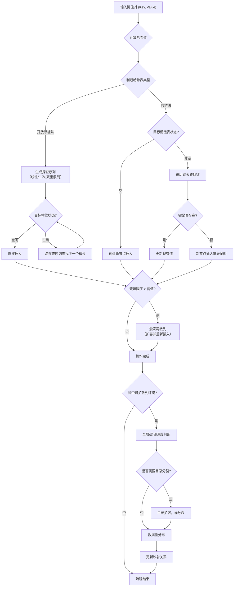

### 哈希表的完整生命周期




🔍 **关键技术说明**

**1. 开放寻址法**

- **探查序列生成**：当初始槽位被占用时，系统会按照特定规则（如线性探测的 `h(k,i) = (h'(k) + i) mod m`）寻找下一个可用槽位。
- **状态判断**：每个槽位有三种状态：空闲、占用、已删除（删除操作需特殊标记避免断链）。
- **适用场景**：数据量可预估、追求缓存局部性的场景，如高性能缓存系统。

**2. 拉链法**

- **链表管理**：每个哈希桶维护一个链表，冲突元素以节点形式链接。
- **插入逻辑**：遍历链表检查键是否存在，不存在则在尾部添加新节点。
- **优势**：适合频繁插入删除的场景，如Java的`HashMap`。

**3. 再散列**

- **触发条件**：当装填因子超过阈值（如0.75）时触发。
- **扩容过程**：创建更大的新表，将所有元素重新哈希到新表。
- **性能影响**：再散列是昂贵操作，但能维持哈希表的高效性。

**4. 可扩散列**

- **目录结构**：使用指向桶的目录，目录大小随数据增长以2的幂次方扩展。
- **桶分裂**：当桶溢出时分裂，并可能触发目录扩容。
- **应用场景**：适合数据库索引等磁盘存储系统，能有效减少磁盘I/O。


### 若干可行性证明

​	在哈希表技术中，**二次散列**（通常指双重散列）和**素数模数/魔术数**的选择是经过严格数学验证的。下面我将分别证明它们的有效性。

#### 一、双重散列（Double Hashing）的有效性证明 ####

##### 1.1 算法描述 #####

双重散列使用两个独立的哈希函数：

- h1(k)：计算初始位置
- h2(k)：计算探测步长（必须满足 1≤h2(k)≤m−1）

探测序列定义为：

```
h(k,i)=(h1(k)+i⋅h2(k))modm(i=0,1,2,…)
```

##### 1.2 完备性定理 #####

**定理**：如果 h~2~(k)与表大小 m互质（即 gcd(h~2~(k),m)=1），则探测序列 {h(k,i)}i=0m−1构成模 m的完全剩余系。

**证明**：

假设存在 i,j（0≤i<j≤m−1）使得：

```
h1(k)+i⋅h2(k)≡h1(k)+j⋅h2(k)(modm)
```

两边消去 h1(k)得：

```
i⋅h2(k)≡j⋅h2(k)(modm)
(j−i)⋅h2(k)≡0(modm)
```

由于 gcd(h~2~(k),m)=1，根据数论定理，h~2~(k)在模 m下有乘法逆元。两边乘以逆元得：

```
j−i≡0(modm)
```

但 0≤j−i<m，故 j−i=0，即 i=j。矛盾。

因此，所有 h(k,i)互不相同，恰好遍历 0,1,…,m−1这 m个值。

##### 1.3 素数模数的必要性 #####

为确保 h~2~(k)与 m互质，常见做法是：

1. 选择 m为素数
2. 定义 h~2~(k)=1+(kmod(m−1))

由于 m是素数，1≤h~2~(k)≤m−1，显然 gcd(h~2~(k),m)=1。

#### 二、平方探测（Quadratic Probing）的有效性证明 ####

##### 2.1 算法描述 #####

探测序列为：

```
h(k,i)=(h′(k)+c1i+c2i2)modm
```

简化形式：h(k,i)=(h′(k)+i2)modm

##### 2.2 有限覆盖定理 #####

**定理**：如果 m是素数且装载因子 α≤0.5，则平方探测一定能找到空位。

**证明**：

考虑前 ⌈m/2⌉个探测位置 h(k,0),h(k,1),…,h(k,⌊m/2⌋)。

假设存在 0≤i<j≤⌊m/2⌋使得：

```
h′(k)+i2≡h′(k)+j2(modm)
```

则：

```
i2≡j2(modm)
(i−j)(i+j)≡0(modm)
```

由于 m是素数，它必须整除 i−j或 i+j。

但：

- ∣i−j∣<m/2<m，所以 m∤(i−j)（除非 i=j）
- 0<i+j<m，所以 m∤(i+j)

矛盾。因此前 ⌈m/2⌉个位置互不相同。当装载因子 α≤0.5时，至少有一半位置为空，故必能找到空位。

##### 2.3 更强结论 #####

若 m是形如 4k+3的素数，平方探测能遍历所有位置（不仅是前一半）。证明基于二次剩余理论。

#### 三、素数模数的有效性证明 ####

##### 3.1 均匀分布性 #####

**定理**：对于除法散列 h(k)=kmodm，若 m是素数，则对于任意键集合 K，哈希值的分布最均匀。

**证明**：

设键集合 K={a+t⋅d∣t=0,1,…,n−1}（等差数列）。若 gcd(d,m)=g>1，则：

```
h(k)=(a+t⋅d)modm∈{x∈Zm∣g∣(x−a)}
```

只有 m/g个可能值，导致冲突率增高。

若 m是素数，则对任意 d=0，有 gcd(d,m)=1。此时：

- 当 t遍历 0,1,…,m−1时，h(k)遍历所有 m个值
- 即使实际键数 n<m，哈希值也尽可能分散

##### 3.2 实际数据验证 #####

对于非随机数据（如偶数序列、幂次序列等），素数模数显著减少冲突：

- 若 m=2^r^，键的低 r位决定哈希值，高位信息丢失
- 若 m是素数，键的所有位都参与运算

#### 四、魔术数（乘数）的有效性证明 ####

##### 4.1 乘法散列分析 #####

乘法散列：h(k)=⌊m⋅(kAmod1)⌋，其中 A∈(0,1)。

**定理**（Knuth）：当 A取黄金分割率倒数 ϕ−1=(5−1)/2≈0.6180339887时，序列 {kA}的偏差最小。

**证明概要**：

考虑序列 xn={nA}（小数部分）。我们希望序列在 [0,1]均匀分布。偏差定义为：

```
DN=0≤a<b≤1supN#{n≤N:xn∈[a,b)}−(b−a)
```

对于任意无理数 A，{nA}在 [0,1]上均匀分布。但收敛速度取决于 A的连分数展开。

黄金分割率 ϕ−1的连分数展开为 [0;1,1,1,…]，是最难逼近的无理数，使得序列 {nϕ−1}的偏差最小化。

##### 4.2 整数乘数选择 #####

对于整数哈希：h(k)=(k⋅C)modm

**定理**：若 gcd(C,m)=1，则映射 k↦(kC)modm是双射。

**证明**：

存在整数 D使得 CD≡1(modm)（因为 C有模 m的逆元）。因此：

- 单射：若 k~1~C≡k~2~C(modm)，则 (k~1~−k~2~)C≡0，乘以 D得 k~1~≡k~2~
- 满射：对任意 y，取 k=yD modm，则 kC≡yDC≡y

常用乘数：

- C=2654435761（32位乘法散列）
- C=11400714819323198485（64位乘法散列）

这些是斐波那契哈希常数，接近 232/ϕ或 264/ϕ。

#### 五、综合比较 ####

| 方法         | 数学保证                   | 条件           | 优点                 | 缺点             |
| ------------ | -------------------------- | -------------- | -------------------- | ---------------- |
| **双重散列** | 完全遍历（当 gcd(h2,m)=1） | h2(k)与 m互质  | 分布均匀，冲突少     | 计算两次哈希     |
| **平方探测** | 前 ⌈m/2⌉位置互异           | m为素数，α≤0.5 | 实现简单，缓存友好   | 可能无法遍历全表 |
| **素数模数** | 避免等差数列聚集           | m为素数        | 对非随机数据鲁棒     | 模运算稍慢       |
| **魔术数**   | 最小化偏差（黄金分割率）   | A为无理数      | 分布均匀，利用所有位 | 浮点运算开销     |


### 可扩散列（Extendible Hashing） ###

​	可扩散列（Extendible Hashing）是一种动态哈希技术，它通过目录结构来扩展哈希表，非常适合数据可能超出内存容量、需要磁盘存储的场景。下面我们基于C语言实现来解析其核心组成部分。

#### 数据结构定义 ####

​	可扩散列的核心是目录和桶（数据块）。目录就像一个索引，根据键值的前几位（全局深度）决定数据存储在哪个桶里。每个桶有自己独立的深度（局部深度），当桶满时，如果局部深度小于全局深度，桶可以分裂而不必扩大目录；如果局部深度等于全局深度，分裂桶就需要先扩大目录。

```c
// 来源于
#define NO 0
#define YES 1
#define M 4        // 初始目录大小
#define LENTH 8     // 数据位数（例如，8位无符号整数）

typedef unsigned char Item; // 存储的数据类型（可扩展）

typedef struct unit {
    Item *array;   // 数据数组
    char sub;      // 当前桶中元素数量
} Unit;           // 数据桶单元

typedef struct subdirectories {
    Unit *point;           // 指向数据桶的指针
    char point_to_itself;  // 标记是否指向自身数据空间
    char byte_index;       // 位索引值
} Subdirectories;          // 目录项

typedef struct table {
    Subdirectories *directory;  // 目录数组
    char directory_size;        // 目录当前大小
    char index_digit;           // 全局深度（索引位数）
    char item_digit;            // 数据位数
    char array_size;            // 每个桶的容量
} *Table;                       // 可扩散列表主结构
```

#### 初始化过程 (`InitializeTable`) ####

​	初始化函数负责创建空的哈希表结构，设定初始容量和深度。目录初始大小通常设为 2初始全局深度，例如全局深度为2时，目录大小为4。

```c
// 基于和
int InitializeTable(Table *ptable) {
    *ptable = (Table)malloc(sizeof(struct table));
    if (NULL == *ptable) return 0;
    
    (*ptable)->directory_size = M;      // 初始目录大小
    (*ptable)->index_digit = M / 2;     // 初始全局深度（例如2）
    (*ptable)->item_digit = LENTH;      // 数据总位数
    (*ptable)->array_size = M;          // 每个桶的初始容量
    
    // 分配并初始化目录项
    (*ptable)->directory = (Subdirectories*)malloc(sizeof(Subdirectories) * M);
    if (NULL == (*ptable)->directory) {
        free(*ptable);
        return 0;
    }
    
    for (int i = 0; i < M; i++) {
        (*ptable)->directory[i].point = NULL;
        (*ptable)->directory[i].point_to_itself = NO;
        (*ptable)->directory[i].byte_index = i; // 设置初始索引
    }
    return 1;
}
```

#### 插入操作 (`Insert`) ####

​	插入操作是可扩散列最复杂的部分，核心在于处理桶溢出时的目录扩展和桶分裂。

1. **计算哈希值**：使用哈希函数提取键值的前 `index_digit`位，确定目录索引。 
```c
// 基于和 
int Hash(const Item *pitem, char constant) 
{    
    return *pitem >> constant;  // 取高位作为索引 
} 

char constant = (*ptable)->item_digit - (*ptable)->index_digit; 
char key = Hash(pitem, constant); // 得到目录索引
```
2. **桶状态检查与插入**： **桶未初始化**：创建新桶并插入数据。 **桶已满**：触发分裂流程。 **桶未满**：直接插入数据。
3. **桶分裂与目录扩展**：当桶满且需要分裂时，如果局部深度等于全局深度，则目录需要倍增（全局深度加1）。然后重新分配原桶中的数据到新桶（根据新增的位判断），并更新目录指针。

#### 查找操作 (`Find`) ####

​	操作相对直接，利用相同的哈希函数定位目录项，然后在对应的桶中线性搜索。

```c
// 基于和
int Find(const Table ptable, const Item *pitem) {
    char constant = ptable->item_digit - ptable->index_digit;
    char key = Hash(pitem, constant);
    
    if (ptable->directory[key].point == NULL) return 0;
    
    Unit *bucket = ptable->directory[key].point;
    for (int i = 0; i < bucket->sub; i++) {
        if (bucket->array[i] == *pitem) return 1;
    }
    return 0;
}
```

#### 内存管理 (`Release`) ####

​	良好的内存管理至关重要，特别是因为可扩散列涉及多级动态分配。释放时需要遍历目录，释放每个桶的数据数组和桶结构本身，最后释放目录和表结构。

```c
// 基于和
void Release(Table *ptable) {
    for (int i = 0; i < (*ptable)->directory_size; i++) {
        if ((*ptable)->directory[i].point != NULL && 
            (*ptable)->directory[i].point_to_itself == YES) {
            free((*ptable)->directory[i].point->array);
            free((*ptable)->directory[i].point);
        }
    }
    free((*ptable)->directory);
    free(*ptable);
    *ptable = NULL;
}
```

#### 关键点与局限性 ####

- **优势**：可扩散列通过目录倍增而非全表重哈希来扩展，减少了大规模数据迁移的开销，特别适合磁盘I/O昂贵的环境。
- **局限性**：示例实现将数据类型限制为`unsigned char`（0-255），实际应用需扩展以支持更复杂类型。目录扩张可能消耗较多内存。
- **优化方向**：可考虑增加负载因子阈值控制分裂时机，或实现目录收缩机制。

