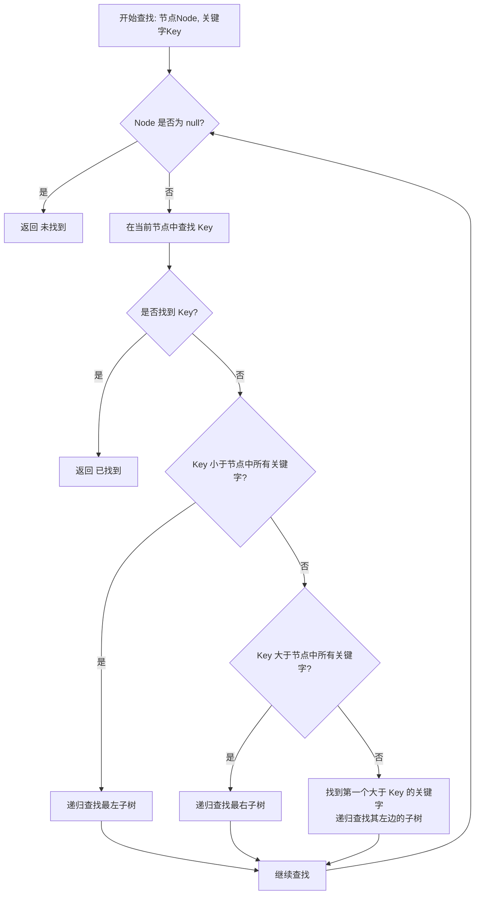
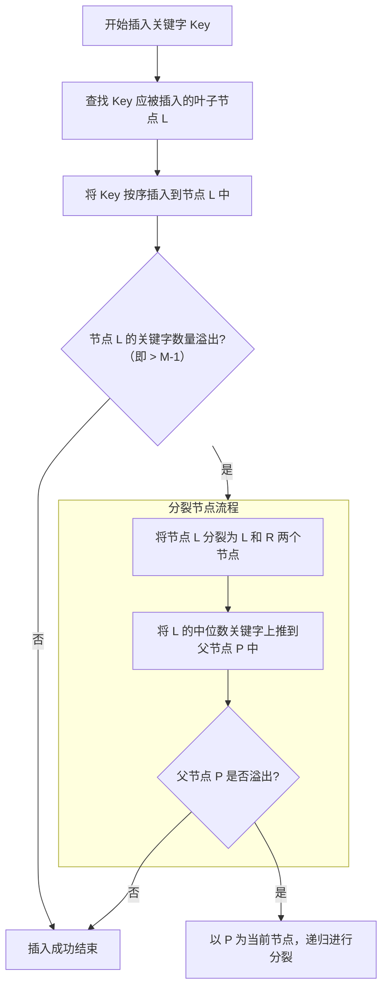
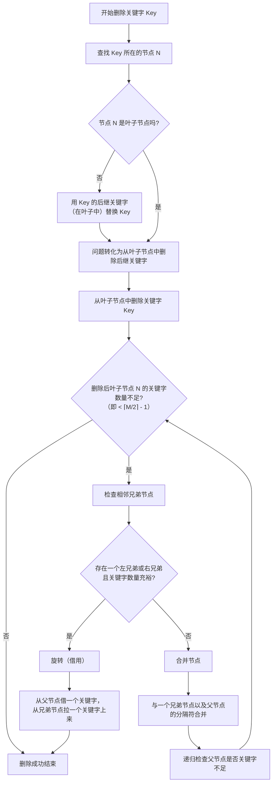
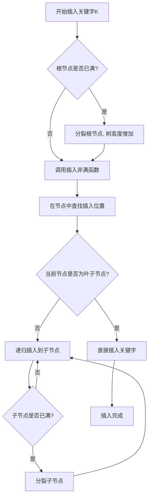
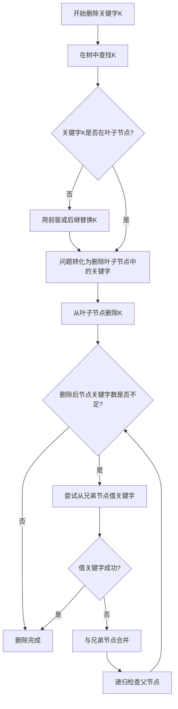

### 伸展树完整实现指南 ###

#### 1. 基本结构与定义 ####

```c
#include <stdio.h>
#include <stdlib.h>

// 伸展树节点结构
typedef struct SplayNode {
    int key;
    struct SplayNode *left;
    struct SplayNode *right;
} SplayNode;
```

#### 2. 核心旋转操作 ####

##### 2.1 右旋（Zig）操作 #####

```c
SplayNode* rightRotate(SplayNode *x) {
    SplayNode *y = x->left;
    x->left = y->right;
    y->right = x;
    return y;
}
```

##### 2.2 左旋（Zag）操作 #####

```c
SplayNode* leftRotate(SplayNode *x) {
    SplayNode *y = x->right;
    x->right = y->left;
    y->left = x;
    return y;
}
```

#### 3. 伸展操作（Splaying） ####

```c
SplayNode* splay(SplayNode *root, int key) {
    // 空树或根节点就是目标
    if (root == NULL || root->key == key)
        return root;
    
    // 键在左子树
    if (key < root->key) {
        // 键不存在
        if (root->left == NULL) return root;
        
        // Zig-Zig（左左情况）
        if (key < root->left->key) {
            root->left->left = splay(root->left->left, key);
            root = rightRotate(root);
        }
        // Zig-Zag（左右情况）  
        else if (key > root->left->key) {
            root->left->right = splay(root->left->right, key);
            if (root->left->right != NULL)
                root->left = leftRotate(root->left);
        }
        
        // 最终右旋
        return (root->left == NULL) ? root : rightRotate(root);
    }
    // 键在右子树
    else {
        // 键不存在
        if (root->right == NULL) return root;
        
        // Zag-Zag（右右情况）
        if (key > root->right->key) {
            root->right->right = splay(root->right->right, key);
            root = leftRotate(root);
        }
        // Zag-Zig（右左情况）
        else if (key < root->right->key) {
            root->right->left = splay(root->right->left, key);
            if (root->right->left != NULL)
                root->right = rightRotate(root->right);
        }
        
        // 最终左旋
        return (root->right == NULL) ? root : leftRotate(root);
    }
}
```

#### 4. 基本操作实现 ####

##### 4.1 查找操作 #####

```c
SplayNode* search(SplayNode *root, int key) {
    return splay(root, key);
}
```

##### 4.2 插入操作 #####

```c
SplayNode* insert(SplayNode *root, int key) {
    // 空树情况
    if (root == NULL) {
        SplayNode *newNode = (SplayNode*)malloc(sizeof(SplayNode));
        newNode->key = key;
        newNode->left = newNode->right = NULL;
        return newNode;
    }
    
    // 伸展最近的节点到根
    root = splay(root, key);
    
    // 键已存在
    if (root->key == key) return root;
    
    // 创建新节点
    SplayNode *newNode = (SplayNode*)malloc(sizeof(SplayNode));
    newNode->key = key;
    
    // 根据键值安排新节点的位置
    if (key < root->key) {
        newNode->right = root;
        newNode->left = root->left;
        root->left = NULL;
    } else {
        newNode->left = root;
        newNode->right = root->right;
        root->right = NULL;
    }
    
    return newNode;
}
```

##### 4.3 删除操作 #####

```c
SplayNode* delete(SplayNode *root, int key) {
    if (root == NULL) return NULL;
    
    // 伸展目标键到根
    root = splay(root, key);
    
    // 键不存在
    if (root->key != key) return root;
    
    SplayNode *temp;
    if (root->left == NULL) {
        // 只有右子树
        temp = root;
        root = root->right;
    } else {
        // 有左子树：将左子树中的最大节点伸展为根
        temp = root;
        root = splay(root->left, key); // 在左子树中伸展
        root->right = temp->right;
    }
    
    free(temp);
    return root;
}
```

#### 5. 辅助函数 ####

##### 5.1 查找最大值节点 #####

```c
SplayNode* findMax(SplayNode *root) {
    if (root == NULL) return NULL;
    while (root->right != NULL)
        root = root->right;
    return root;
}
```

##### 5.2 中序遍历 #####

```c
void inOrder(SplayNode *root) {
    if (root != NULL) {
        inOrder(root->left);
        printf("%d ", root->key);
        inOrder(root->right);
    }
}
```

##### 5.3 前序遍历 #####

```c
void preOrder(SplayNode *root) {
    if (root != NULL) {
        printf("%d ", root->key);
        preOrder(root->left);
        preOrder(root->right);
    }
}
```

#### 6. 完整测试示例 ####

```c
#include <stdio.h>
#include <stdlib.h>

// 将所有上述函数定义放在这里

int main() {
    SplayNode *root = NULL;
    
    // 插入测试
    root = insert(root, 10);
    root = insert(root, 20);
    root = insert(root, 30);
    root = insert(root, 40);
    root = insert(root, 50);
    
    printf("插入后的中序遍历: ");
    inOrder(root);
    printf("\n");
    
    // 查找测试
    root = search(root, 20);
    printf("查找20后的根节点: %d\n", root->key);
    
    // 删除测试
    root = delete(root, 30);
    printf("删除30后的中序遍历: ");
    inOrder(root);
    printf("\n");
    
    return 0;
}
```

#### 7. 性能分析 ####

| 操作     | 最坏情况 | 摊还复杂度 | 说明                         |
| -------- | -------- | ---------- | ---------------------------- |
| **查找** | O(n)     | O(log n)   | 单次可能较慢，但序列操作高效 |
| **插入** | O(n)     | O(log n)   | 插入后自动伸展到根           |
| **删除** | O(n)     | O(log n)   | 删除后相关节点伸展           |
| **空间** | O(n)     | O(n)       | 与标准BST相同                |


### AVL树与伸展树的联系 ###

#### 1、基本概念关联 ####

- **同属自平衡二叉搜索树**：两者都是二叉搜索树的变种，旨在通过旋转操作维持树的平衡性
- **共享基础操作**：都支持插入、删除、查找等基本操作，且都使用旋转机制进行平衡调整
- **时间复杂度目标**：都追求在平均情况下达到O(log n)的时间复杂度

#### 2、旋转操作的异同 ####

- **共同点**：都使用单旋转和双旋转（Zig-Zig、Zig-Zag等类似概念）
- **差异点**： 
  - AVL树：旋转基于严格的平衡因子（高度差≤1）
  - 伸展树：旋转基于访问模式，最近访问的节点被移动到根位置


#### 3、平衡策略对比 ####

**AVL树的平衡特性**

- **严格平衡**：保证任意节点的左右子树高度差不超过1
- **全局平衡**：通过维护每个节点的高度信息实现整体平衡
- **静态优化**：平衡策略与数据访问频率无关

**伸展树的平衡特性**

- **局部性原理**：利用"访问局部性"，频繁访问的节点靠近根节点
- **自适应平衡**：根据访问模式动态调整结构
- **摊还分析**：单个操作可能较慢，但序列操作效率高

#### 4、性能特征关联 ####

- **最坏情况保证**：
  - AVL树：严格保证O(log n)的最坏情况复杂度
  - 伸展树：最坏情况O(n)，但摊还复杂度为O(log n)

- **实际性能**： 
  - 在随机访问模式下，AVL树通常表现更稳定
  - 在具有局部性的访问模式下，伸展树可能更优


#### 5、应用场景联系 ####

- **AVL适用场景**： 
  - 查找操作远多于插入删除的场景
  - 需要保证最坏情况性能的应用
  - 对查询时间有严格要求的系统
- **伸展树适用场景**： 访问模式具有明显局部性的应用
  - 缓存系统、垃圾回收算法
  - 数据访问存在"热点"模式的场景


### 伸展树三级节点操作总结 ###

#### 1、核心概念理解 ####

**三级节点操作的本质**

​	伸展树的三级节点操作（Zig-Zig、Zig-Zag等）不是像AVL树那样为了**维持静态平衡**，而是为了实现**动态访问优化**。其核心目标是利用局部性原理，让频繁访问的节点靠近树根。

**与AVL树的根本区别**

| 特性         | AVL树              | 伸展树           |
| ------------ | ------------------ | ---------------- |
| **设计目标** | 保持严格的高度平衡 | 优化访问路径效率 |
| **旋转触发** | 平衡因子超出±1     | 每次访问操作     |
| **数学保证** | 最坏情况O(log n)   | 摊还O(log n)     |

#### 2、三级节点的必要性 ####

**1. 效率数学保证**

- **二级操作缺陷**：每次只能上移一层，最坏情况O(n)
- **三级操作优势**：每次上移两层，通过势能分析保证摊还O(log n)

**2. 路径压缩效应**

```c
// 三级操作同时优化整个访问路径
初始路径: root → 祖父 → 父 → 目标
优化后: 目标 → 父 → 祖父 → root
```

**3. 局部性充分利用**

- 不仅优化目标节点，还优化其访问路径上的所有节点
- 符合CPU缓存的空间局部性原则

#### 3、代码实现关键 ####

**健壮的三级节点检测**

```c
bool canPerformThreeLevel(SplayNode *root, int key, bool isLeftSubtree) {
    if (root == NULL) return false;
    
    if (isLeftSubtree) {
        if (root->left == NULL) return false;  // 第一级剪枝
        return (key < root->left->key) ? 
            (root->left->left != NULL) :      // Zig-Zig检查
            (root->left->right != NULL);     // Zig-Zag检查
    }
    // 右子树对称逻辑
}
```

**安全的三级操作模式**

```c
// 1. 预先检查可用性
if (canPerformThreeLevel(root, key, true)) {
    // 2. 执行三级操作
    root->left->left = splay(root->left->left, key);
    root = rightRotate(root);
} else {
    // 3. 优雅降级到单旋转
    return (root->left != NULL) ? rightRotate(root) : root;
}
```

#### 4、NULL剪枝策略 ####

**分层防御机制**

1. **第一层**：基础指针检查 `if (root == NULL)`
2. **第二层**：子节点存在性验证 `if (root->left != NULL)`
3. **第三层**：孙子节点可用性检查 `if (root->left->left != NULL)`

```c
SplayNode* safeRightRotate(SplayNode *x) {
    if (x == NULL) return NULL;           // 层1防御
    if (x->left == NULL) return x;        // 层2防御
    
    SplayNode *y = x->left;
    // 正常旋转逻辑...
    return y;
}
```


### B树完整实现指南 ###

B树是一种自平衡的多路搜索树，能保持数据有序，并优化对磁盘存储系统（I/O操作）的访问。

------

#### 1. B树查找操作 ####

**核心思想**：类似二叉搜索树，但在每个节点中进行多路选择。

**流程图**：



**流程解读**：

1. **初始化**：从根节点开始查找。
2. **节点内搜索**：在当前节点中顺序或二分查找关键字 `K`。
3. **决策**： 如果找到 `K`，则查找成功。 如果未找到，则确定 `K`所在的子树区间，递归地搜索对应的子树。
4. **终止条件**：搜索到达叶子节点且未找到，则宣告失败。

------

#### 2. B树插入操作 ####

**核心思想**：始终插入到叶子节点，并通过分裂来维持平衡。

**流程图**：



**流程解读**：

1. **定位叶子**：首先查找到关键字 `Key`应该被插入的叶子节点。
2. **插入叶子**：将 `Key`按顺序插入到该叶子节点中。
3. **检查溢出**：检查插入后节点内的关键字数量是否超过了上限（`M-1`）。
4. **分裂节点（如需要）**： 如果溢出，则将节点**分裂**成两个节点。 将**中位数关键字**上推到父节点中。 递归检查父节点是否溢出，如果溢出则继续分裂。这个过程可能一直向上传播到根节点，从而导致树的高度增加。

------

#### 3. B树删除操作 ####

**核心思想**：从叶子节点删除关键字，并通过合并、旋转（借用）来维持平衡。这是最复杂的操作。

**流程图**：



**流程解读**：

1. **定位与简化**： 找到包含 `Key`的节点。 如果 `Key`不在叶子节点，用其**后继**（或前驱）关键字替换它，从而将问题转化为**从叶子节点中删除**。
2. **从叶子节点删除**：直接删除关键字 `Key`。
3. **检查下溢**：检查删除后节点内的关键字数量是否少于最小值（`⌈M/2⌉ - 1`）。
4. **重新平衡（如发生下溢）**： **Case 1: 旋转（借用）**：如果某个相邻兄弟节点关键字充裕，则从兄弟节点“借”一个关键字，并通过父节点关键字进行旋转。这是首选方案，因为它不会减少节点数量。 **Case 2: 合并**：如果相邻兄弟节点都不充裕，则将该节点、一个兄弟节点以及父节点中分隔它们的关键字**合并**成一个节点。这可能导致父节点关键字不足，因此需要**递归向上**检查并重新平衡。

------

#### 4、核心要点总结 ####

| 操作     | 核心目标             | 关键维护操作         | 时间复杂度   |
| -------- | -------------------- | -------------------- | ------------ |
| **查找** | 定位关键字           | 无                   | **O(logᴍn)** |
| **插入** | 在叶子节点添加关键字 | **分裂**             | **O(logᴍn)** |
| **删除** | 从叶子节点移除关键字 | **合并** 或 **旋转** | **O(logᴍn)** |

**核心优势**：所有操作都只需访问从根到叶的一条路径上的节点，极大地减少了磁盘I/O次数，这正是B树被广泛应用于数据库和文件系统的根本原因。


### B树C语言实现 ###

下面是一个完整的B树实现，分为多个逻辑块，包括结构定义、查找、插入、删除等核心操作。

#### 1. 头文件定义和数据结构 ####

```c
#ifndef BTREE_H
#define BTREE_H

#include <stdio.h>
#include <stdlib.h>
#include <stdbool.h>

// B树的阶数 - 每个节点最多有2*M-1个关键字
#define M 3

typedef struct BTreeNode {
    int n;                          // 当前关键字数量
    int keys[2*M-1];               // 关键字数组
    struct BTreeNode* children[2*M]; // 子节点指针数组
    bool leaf;                      // 是否为叶子节点
} BTreeNode;

typedef struct {
    BTreeNode* root;                // 根节点
} BTree;

// 函数声明
BTree* btree_create();
BTreeNode* btree_search(BTreeNode* node, int key, int* index);
void btree_insert(BTree* tree, int key);
void btree_delete(BTree* tree, int key);
void btree_print(BTree* tree);
void btree_free(BTree* tree);

#endif
```

#### 2. 内存管理和初始化函数 ####

```c
#include "btree.h"

// 创建新节点
BTreeNode* btree_create_node(bool leaf) {
    BTreeNode* node = (BTreeNode*)malloc(sizeof(BTreeNode));
    node->n = 0;
    node->leaf = leaf;
    
    for (int i = 0; i < 2*M; i++) {
        node->children[i] = NULL;
    }
    
    return node;
}

// 创建空B树
BTree* btree_create() {
    BTree* tree = (BTree*)malloc(sizeof(BTree));
    tree->root = btree_create_node(true);  // 初始时根节点是叶子
    return tree;
}

// 释放B树内存
void btree_free_node(BTreeNode* node) {
    if (node == NULL) return;
    
    if (!node->leaf) {
        for (int i = 0; i <= node->n; i++) {
            btree_free_node(node->children[i]);
        }
    }
    
    free(node);
}

void btree_free(BTree* tree) {
    btree_free_node(tree->root);
    free(tree);
}
```

#### 3. 查找操作实现 ####

```c
// 查找关键字，如果找到返回节点指针，index返回关键字位置
BTreeNode* btree_search(BTreeNode* node, int key, int* index) {
    int i = 0;
    
    // 在当前节点中找到第一个大于等于key的位置
    while (i < node->n && key > node->keys[i]) {
        i++;
    }
    
    // 检查是否找到关键字
    if (i < node->n && key == node->keys[i]) {
        *index = i;
        return node;
    }
    
    // 如果是叶子节点且没找到，返回NULL
    if (node->leaf) {
        return NULL;
    }
    
    // 递归搜索合适的子树
    return btree_search(node->children[i], key, index);
}
```

#### 4. 插入操作实现 ####

```c
// 分裂子节点
void btree_split_child(BTreeNode* parent, int index) {
    BTreeNode* child = parent->children[index];
    BTreeNode* new_child = btree_create_node(child->leaf);
    //new_child节点与child节点互为兄弟节点，故层高同级，同为/非叶子节点
    
    // 新节点获取后半部分的关键字
    new_child->n = M - 1;
    for (int j = 0; j < M - 1; j++) {
        new_child->keys[j] = child->keys[j + M];
    }
    
    // 如果不是叶子节点，复制子节点指针
    if (!child->leaf) {
        for (int j = 0; j < M; j++) {
            new_child->children[j] = child->children[j + M];
        }
    }
    child->n = M - 1;
    //child在左，有M-1个关键字；new_child在右，有M个关键字
    
    // 在父节点中为新子节点腾出空间
    for (int j = parent->n; j >= index + 1; j--) {
        parent->children[j + 1] = parent->children[j];
    }
    parent->children[index + 1] = new_child;
    
    // 在父节点中移动关键字并为新关键字腾出空间
    for (int j = parent->n - 1; j >= index; j--) {
        parent->keys[j + 1] = parent->keys[j];
    }
    
    // 将中间关键字提升到父节点
    parent->keys[index] = child->keys[M - 1];//此时的child第M-1个g'j'z已然废弃
    parent->n++;
}

// 插入关键字到非满节点
void btree_insert_nonfull(BTreeNode* node, int key) {
    int i = node->n - 1;
    
    if (node->leaf) {
        // 叶子节点：找到插入位置并移动关键字
        while (i >= 0 && key < node->keys[i]) {
            node->keys[i + 1] = node->keys[i];
            i--;
        }
        node->keys[i + 1] = key;
        node->n++;
    } else {
        // 内部节点：找到合适的子节点
        while (i >= 0 && key < node->keys[i]) {
            i--;
        }
        i++;
        
        // 如果子节点已满，先分裂
        if (node->children[i]->n == 2*M - 1) {
            btree_split_child(node, i);
            
            // 确定插入到哪个子节点
            if (key > node->keys[i]) {
                i++;
            }
        }
        
        btree_insert_nonfull(node->children[i], key);
    }
}

// 插入主函数
void btree_insert(BTree* tree, int key) {
    BTreeNode* root = tree->root;
    
    // 如果根节点已满，需要分裂并创建新的根节点
    if (root->n == 2*M - 1) {
        BTreeNode* new_root = btree_create_node(false);
        new_root->children[0] = root;
        tree->root = new_root;
        btree_split_child(new_root, 0);
        btree_insert_nonfull(new_root, key);
    } else {
        btree_insert_nonfull(root, key);
    }
}
```

#### 5. 删除操作实现 ####

```c
// 获取前驱关键字
int btree_get_predecessor(BTreeNode* node, int index) {
    BTreeNode* current = node->children[index];
    while (!current->leaf) {
        current = current->children[current->n];
    }
    return current->keys[current->n - 1];
}

// 获取后继关键字
int btree_get_successor(BTreeNode* node, int index) {
    BTreeNode* current = node->children[index + 1];
    while (!current->leaf) {
        current = current->children[0];
    }
    return current->keys[0];
}

// 合并子节点
void btree_merge(BTreeNode* node, int index) {
    BTreeNode* child = node->children[index];
    BTreeNode* sibling = node->children[index + 1];
    
    // 将父节点的关键字下移到子节点
    child->keys[M - 1] = node->keys[index];
    
    // 复制兄弟节点的关键字
    for (int i = 0; i < sibling->n; i++) {
        child->keys[i + M] = sibling->keys[i];
    }
    
    // 复制兄弟节点的子节点（如果不是叶子）
    if (!child->leaf) {
        for (int i = 0; i <= sibling->n; i++) {
            child->children[i + M] = sibling->children[i];
        }
    }
    
    // 移动父节点的关键字和子节点
    for (int i = index + 1; i < node->n; i++) {
        node->keys[i - 1] = node->keys[i];
    }
    for (int i = index + 2; i <= node->n; i++) {
        node->children[i - 1] = node->children[i];
    }
    
    child->n += sibling->n + 1;
    node->n--;
    
    free(sibling);
}

// 从左兄弟借关键字
void btree_borrow_from_prev(BTreeNode* node, int index) {
    BTreeNode* child = node->children[index];
    BTreeNode* sibling = node->children[index - 1];
    
    // 为借来的关键字腾出空间
    for (int i = child->n - 1; i >= 0; i--) {
        child->keys[i + 1] = child->keys[i];
    }
    
    // 如果不是叶子，移动子节点指针
    if (!child->leaf) {
        for (int i = child->n; i >= 0; i--) {
            child->children[i + 1] = child->children[i];
        }
    }
    
    // 将父节点的关键字下移，兄弟节点的关键字上移
    child->keys[0] = node->keys[index - 1];
    if (!child->leaf) {
        child->children[0] = sibling->children[sibling->n];
    }
    
    node->keys[index - 1] = sibling->keys[sibling->n - 1];
    
    child->n++;
    sibling->n--;
}

// 从右兄弟借关键字
void btree_borrow_from_next(BTreeNode* node, int index) {
    BTreeNode* child = node->children[index];
    BTreeNode* sibling = node->children[index + 1];
    
    // 从父节点借关键字
    child->keys[child->n] = node->keys[index];
    
    // 从兄弟节点借第一个子节点（如果不是叶子）
    if (!child->leaf) {
        child->children[child->n + 1] = sibling->children[0];
    }
    
    // 从兄弟节点借第一个关键字
    node->keys[index] = sibling->keys[0];
    
    // 移动兄弟节点的关键字和子节点
    for (int i = 1; i < sibling->n; i++) {
        sibling->keys[i - 1] = sibling->keys[i];
    }
    if (!sibling->leaf) {
        for (int i = 1; i <= sibling->n; i++) {
            sibling->children[i - 1] = sibling->children[i];
        }
    }
    
    child->n++;
    sibling->n--;
}

// 填充关键字不足的子节点
void btree_fill(BTreeNode* node, int index) {
    // 如果前一个子节点有足够的关键字，借一个
    if (index != 0 && node->children[index - 1]->n >= M) {
        btree_borrow_from_prev(node, index);
    }
    // 如果后一个子节点有足够的关键字，借一个
    else if (index != node->n && node->children[index + 1]->n >= M) {
        btree_borrow_from_next(node, index);
    }
    // 否则合并子节点
    else {
        if (index != node->n) {
            btree_merge(node, index);
        } else {
            btree_merge(node, index - 1);
        }
    }
}

// 从子树中删除关键字
void btree_remove_from_subtree(BTreeNode* node, int key) {
    int idx = 0;
    
    // 找到第一个大于等于key的关键字位置
    while (idx < node->n && node->keys[idx] < key) {
        idx++;
    }
    
    // 如果关键字在当前节点中
    if (idx < node->n && node->keys[idx] == key) {
        if (node->leaf) {
            // 情况1: 关键字在叶子节点中
            for (int i = idx + 1; i < node->n; i++) {
                node->keys[i - 1] = node->keys[i];
            }
            node->n--;
        } else {
            // 情况2: 关键字在内部节点中
            
            // 如果前驱子节点有足够的关键字
            if (node->children[idx]->n >= M) {
                int pred = btree_get_predecessor(node, idx);
                node->keys[idx] = pred;
                btree_remove_from_subtree(node->children[idx], pred);
            }
            // 如果后继子节点有足够的关键字
            else if (node->children[idx + 1]->n >= M) {
                int succ = btree_get_successor(node, idx);
                node->keys[idx] = succ;
                btree_remove_from_subtree(node->children[idx + 1], succ);
            }
            // 两个子节点关键字都不足，需要合并
            else {
                btree_merge(node, idx);
                btree_remove_from_subtree(node->children[idx], key);
            }
        }
    } else {
        // 关键字不在当前节点中
        
        // 如果是叶子节点，说明关键字不存在
        if (node->leaf) {
            printf("Key %d not found in the tree\n", key);
            return;
        }
        
        // 标记是否在最后一个子节点中
        bool flag = (idx == node->n);
        
        // 如果子节点关键字不足，先填充
        if (node->children[idx]->n < M) {
            btree_fill(node, idx);
        }
        
        // 如果合并发生在最后一个子节点，需要调整索引
        if (flag && idx > node->n) {
            btree_remove_from_subtree(node->children[idx - 1], key);
        } else {
            btree_remove_from_subtree(node->children[idx], key);
        }
    }
}

// 删除主函数
void btree_delete(BTree* tree, int key) {
    if (tree->root == NULL) {
        printf("Tree is empty\n");
        return;
    }
    
    btree_remove_from_subtree(tree->root, key);
    
    // 如果根节点关键字数为0，降低树的高度
    if (tree->root->n == 0) {
        BTreeNode* temp = tree->root;
        if (tree->root->leaf) {
            tree->root = NULL;
        } else {
            tree->root = tree->root->children[0];
        }
        free(temp);
    }
}
```

#### 6. 辅助函数和测试代码 ####

```c
// 打印B树（中序遍历）
void btree_print_node(BTreeNode* node, int level) {
    if (node == NULL) return;
    
    printf("Level %d: ", level);
    for (int i = 0; i < node->n; i++) {
        printf("%d ", node->keys[i]);
    }
    printf("\n");
    
    if (!node->leaf) {
        for (int i = 0; i <= node->n; i++) {
            btree_print_node(node->children[i], level + 1);
        }
    }
}

void btree_print(BTree* tree) {
    btree_print_node(tree->root, 0);
    printf("\n");
}

// 测试函数
int main() {
    BTree* tree = btree_create();
    
    printf("Inserting keys: 10, 20, 5, 6, 12, 30, 7, 17\n");
    int keys[] = {10, 20, 5, 6, 12, 30, 7, 17};
    int n = sizeof(keys) / sizeof(keys[0]);
    
    for (int i = 0; i < n; i++) {
        btree_insert(tree, keys[i]);
    }
    
    printf("B-tree structure:\n");
    btree_print(tree);
    
    printf("Searching for key 6: ");
    int index;
    BTreeNode* result = btree_search(tree->root, 6, &index);
    if (result != NULL) {
        printf("Found at index %d\n", index);
    } else {
        printf("Not found\n");
    }
    
    printf("Deleting key 6\n");
    btree_delete(tree, 6);
    printf("B-tree structure after deletion:\n");
    btree_print(tree);
    
    printf("Deleting key 13 (not in tree)\n");
    btree_delete(tree, 13);
    
    btree_free(tree);
    
    return 0;
}
```

#### 7. 编译和运行 ####

创建 `btree.h`和 `btree.c`文件，然后编译运行：

```bash
gcc -o btree btree.c
./btree
```

#### 8. 核心操作流程图 ####

##### 插入操作流程 #####



##### 删除操作流程 #####



这个实现包含了B树的所有核心操作，并遵循了B树的性质：

1. 每个节点最多有2M-1个关键字
2. 每个非根节点至少有M-1个关键字
3. 所有叶子节点都在同一层
4. 插入和删除操作保持了树的平衡性
